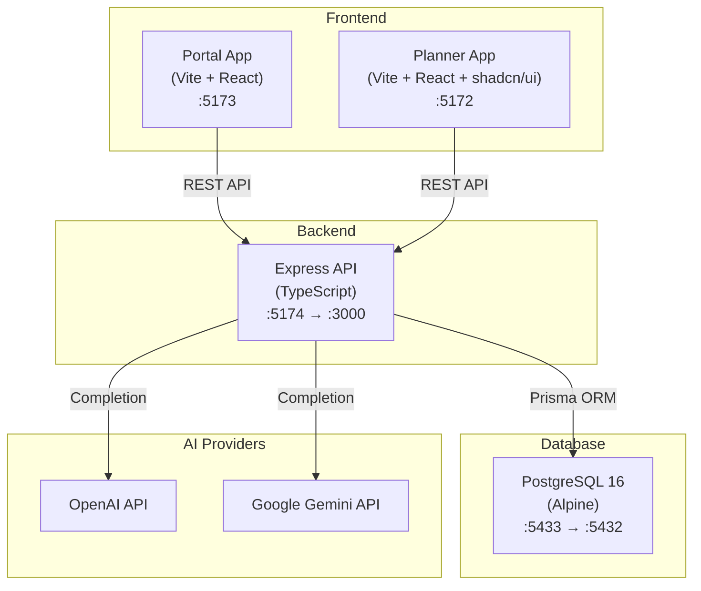
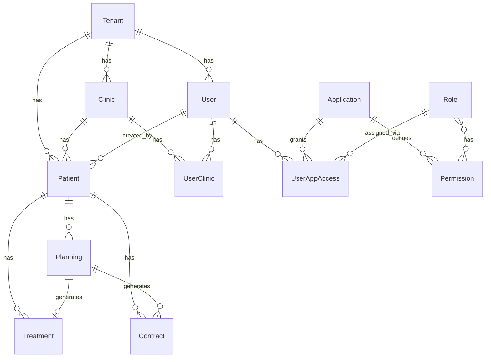
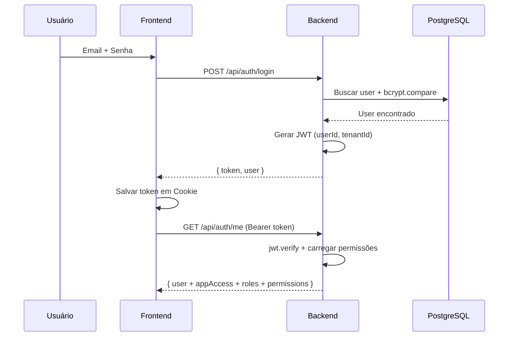

# 📋 Ortho AI Planner — Documentação Completa

> Sistema inteligente de planejamento ortodôntico assistido por IA, com gestão multi-tenant, multi-clínica, controle de permissões (RBAC) e geração automatizada de contratos.

---

## Índice

1. [Visão Geral](#1-visão-geral)
2. [Arquitetura do Sistema](#2-arquitetura-do-sistema)
3. [Stack Tecnológica](#3-stack-tecnológica)
4. [Banco de Dados (Schema)](#4-banco-de-dados-schema)
5. [Backend (API REST)](#5-backend-api-rest)
6. [Frontend — Planner App](#6-frontend--planner-app)
7. [Frontend — Portal App](#7-frontend--portal-app)
8. [Autenticação & Autorização](#8-autenticação--autorização)
9. [Integração com IA](#9-integração-com-ia)
10. [Deployment](#10-deployment)
11. [Desenvolvimento Local](#11-desenvolvimento-local)
12. [Variáveis de Ambiente](#12-variáveis-de-ambiente)
13. [Scripts Úteis](#13-scripts-úteis)
14. [Estrutura de Pastas](#14-estrutura-de-pastas)

---

## 1. Visão Geral

O **Ortho AI Planner** é uma plataforma para clínicas odontológicas que combina:

- **Planejamento ortodôntico com IA** — Gera planos de tratamento a partir de relatórios clínicos usando OpenAI/Gemini
- **Gestão de pacientes** — Cadastro, histórico, transferência entre profissionais
- **Contratos digitais** — Geração e assinatura eletrônica de termos de compromisso
- **Acompanhamento de tratamentos** — Controle de status, prazos e agendamentos
- **Relatórios analíticos** — Dashboards com dados de pacientes, planejamentos, financeiro e tratamentos
- **Portal administrativo** — Gestão de clínicas, usuários, roles e permissões

### Público-alvo

- Ortodontistas e dentistas
- Assistentes clínicos
- Administradores de clínicas odontológicas

---

## 2. Arquitetura do Sistema



### Comunicação entre serviços

| De | Para | Protocolo | Porta |
|----|------|-----------|-------|
| Portal → Backend | REST (fetch) | `:5174` (externa) → `:3000` (interna) |
| Planner → Backend | REST (fetch) | `:5174` (externa) → `:3000` (interna) |
| Backend → PostgreSQL | TCP (Prisma) | `:5433` (externa) → `:5432` (interna) |
| Backend → OpenAI/Gemini | HTTPS | Portas padrão |

> Os frontends usam Nginx como proxy reverso em produção, redirecionando `/api/*` para o backend interno (`INTERNAL_BACKEND_URL`).

---

## 3. Stack Tecnológica

### Backend

| Tecnologia | Versão | Função |
|-----------|--------|--------|
| **Node.js + TypeScript** | TS 5.3 | Runtime e tipagem |
| **Express** | 4.21 | Servidor HTTP / REST API |
| **Prisma** | 6.19 | ORM e migrations |
| **PostgreSQL** | 16 Alpine | Banco de dados relacional |
| **jsonwebtoken** | 9.0 | Autenticação JWT |
| **bcryptjs** | 3.0 | Hash de senhas |

### Frontend — Planner

| Tecnologia | Versão | Função |
|-----------|--------|--------|
| **React** | 18.3 | UI Library |
| **Vite** | 5.4 | Build tool |
| **TypeScript** | 5.8 | Tipagem |
| **TailwindCSS** | 3.4 | Estilização |
| **shadcn/ui** (Radix) | — | Componentes UI |
| **React Router DOM** | 6.30 | Roteamento |
| **TanStack React Query** | 5.83 | Cache e estado de servidor |
| **Recharts** | 2.15 | Gráficos e relatórios |
| **React Hook Form + Zod** | — | Formulários e validação |
| **jsPDF + html2canvas** | — | Geração de PDF |
| **date-fns** | 3.6 | Manipulação de datas |
| **Sonner** | 1.7 | Notificações toast |
| **@google/generative-ai** | 0.24 | Cliente Gemini |

### Frontend — Portal

| Tecnologia | Versão | Função |
|-----------|--------|--------|
| **React** | — | UI Library |
| **Vite** | — | Build tool |
| **TailwindCSS** | — | Estilização |

### Infraestrutura

| Tecnologia | Função |
|-----------|--------|
| **Docker + Docker Compose** | Containerização |
| **Nginx** | Reverse proxy (produção) |
| **aaPanel / EasyPanel** | Painel de administração do servidor |

---

## 4. Banco de Dados (Schema)

### Diagrama de Entidade-Relacionamento



### Modelos (13 tabelas)

#### `Tenant` — Multi-tenancy

| Campo | Tipo | Descrição |
|-------|------|-----------|
| `id` | UUID (PK) | Identificador único |
| `name` | String | Nome da organização |
| `createdAt` | DateTime | Data de criação |
| `updatedAt` | DateTime | Última atualização |

> Isola dados entre diferentes organizações.

---

#### `Clinic` — Clínicas

| Campo | Tipo | Descrição |
|-------|------|-----------|
| `id` | UUID (PK) | Identificador único |
| `name` | String | Nome oficial |
| `nickname` | String? | Apelido para exibição |
| `logoUrl` | String? | URL do logo |
| `cro` | String? | Número do CRO |
| `website` | String? | Site da clínica |
| `zipCode`, `street`, `number`, `complement`, `district`, `city`, `state` | String? | Endereço estruturado |
| `address` | String? | Endereço legado |
| `tenantId` | UUID (FK) | Referência ao tenant |

---

#### `User` — Usuários

| Campo | Tipo | Descrição |
|-------|------|-----------|
| `id` | UUID (PK) | Identificador único |
| `email` | String (unique) | Email de login |
| `password` | String | Hash bcrypt |
| `name` | String | Nome completo |
| `nickname` | String? | Apelido |
| `cro` | String? | Registro profissional |
| `avatarUrl` | String? | Foto de perfil |
| `isSuperAdmin` | Boolean | Acesso total |
| `canTransferPatient` | Boolean | Pode transferir pacientes |
| `tenantId` | UUID (FK) | Referência ao tenant |

---

#### `UserClinic` — Associação Usuário ↔ Clínica

| Campo | Tipo | Descrição |
|-------|------|-----------|
| `userId` | UUID (FK) | Usuário |
| `clinicId` | UUID (FK) | Clínica |

> Constraint unique: `(userId, clinicId)`

---

#### `Application` — Aplicações do Sistema

| Campo | Tipo | Descrição |
|-------|------|-----------|
| `name` | String (unique) | Identificador (`portal`, `planner`) |
| `displayName` | String | Nome exibido |
| `description` | String? | Descrição |
| `icon` | String? | Ícone (Lucide) |
| `url` | String? | URL da aplicação |

---

#### `Role` — Perfis de acesso

| Campo | Tipo | Descrição |
|-------|------|-----------|
| `name` | String (unique) | `ADMIN`, `DENTISTA`, `ASSISTENTE` |
| `description` | String? | Descrição do perfil |

---

#### `Permission` — Permissões granulares

| Campo | Tipo | Descrição |
|-------|------|-----------|
| `action` | String | `read`, `write`, `delete`, `manage` |
| `resource` | String | `patient`, `planning`, `contract`, `report_*`, etc. |
| `applicationId` | UUID? (FK) | Escopo da aplicação |

> Constraint unique: `(action, resource)`

---

#### `UserAppAccess` — Acesso Usuário → App + Role

| Campo | Tipo | Descrição |
|-------|------|-----------|
| `userId` | UUID (FK) | Usuário |
| `applicationId` | UUID (FK) | Aplicação |
| `roleId` | UUID (FK) | Role atribuída |

> Constraint unique: `(userId, applicationId)` — um role por app por usuário.

---

#### `Patient` — Pacientes

| Campo | Tipo | Descrição |
|-------|------|-----------|
| `id` | UUID (PK) | Identificador único |
| `patientNumber` | String? | Nº de registro |
| `paymentType` | String? | `Convênio` ou `Particular` |
| `insuranceCompany` | String? | Operadora do convênio |
| `name` | String | Nome completo |
| `birthDate` | DateTime? | Data de nascimento |
| `email` | String? | Email |
| `phone` | String? | Telefone |
| `externalId` | String? | ID externo |
| `tenantId` | UUID (FK) | Tenant |
| `userId` | UUID (FK) | Profissional responsável |
| `clinicId` | UUID (FK) | Clínica |

---

#### `Planning` — Planejamentos ortodônticos

| Campo | Tipo | Descrição |
|-------|------|-----------|
| `id` | UUID (PK) | Identificador único |
| `title` | String | Título do planejamento |
| `status` | String | `DRAFT`, etc. |
| `patientId` | UUID (FK) | Paciente |
| `originalReport` | String? | Relatório clínico original |
| `aiResponse` | String? | Resposta pura da IA |
| `structuredPlan` | JSON? | Plano estruturado (JSON) |

---

#### `Treatment` — Tratamentos

| Campo | Tipo | Descrição |
|-------|------|-----------|
| `id` | UUID (PK) | Identificador único |
| `planningId` | UUID? (FK, unique) | Planejamento de origem |
| `patientId` | UUID? (FK) | Paciente |
| `status` | String | `EM_ANDAMENTO`, `CONCLUIDO`, `CANCELADO` |
| `startDate` | DateTime | Data de início |
| `deadline` | DateTime? | Prazo final |
| `endDate` | DateTime? | Data de conclusão |
| `lastAppointment` | DateTime? | Última consulta |
| `nextAppointment` | DateTime? | Próxima consulta |
| `notes` | String? | Observações |

---

#### `Contract` — Contratos / Termos de compromisso

| Campo | Tipo | Descrição |
|-------|------|-----------|
| `id` | UUID (PK) | Identificador único |
| `patientId` | UUID (FK) | Paciente |
| `content` | String | Conteúdo HTML/texto do contrato |
| `logoUrl` | String? | Logo para impressão |
| `isSigned` | Boolean | Se foi assinado |
| `signedAt` | DateTime? | Data da assinatura |
| `planningId` | UUID? (FK) | Planejamento relacionado |

---

#### `AiApiKey` — Chaves de API de IA

| Campo | Tipo | Descrição |
|-------|------|-----------|
| `provider` | String (unique) | `openai`, `gemini`, etc. |
| `key` | String | Chave da API |
| `isActive` | Boolean | Se está ativa |

---

## 5. Backend (API REST)

### Visão geral

O backend é um servidor **Express** em TypeScript que expõe uma API REST completa. Usa **Prisma** como ORM para PostgreSQL.

### Referência de Endpoints

#### 🔐 Autenticação

| Método | Endpoint | Descrição | Auth |
|--------|----------|-----------|------|
| `POST` | `/api/auth/register` | Registro de novo usuário | ❌ |
| `POST` | `/api/auth/login` | Login (retorna JWT) | ❌ |
| `GET` | `/api/auth/me` | Dados do usuário logado | ✅ |

---

#### 👤 Pacientes

| Método | Endpoint | Descrição | Permissão |
|--------|----------|-----------|-----------|
| `GET` | `/api/patients` | Listar pacientes | `read:patient` |
| `POST` | `/api/patients` | Criar paciente | `write:patient` |
| `POST` | `/api/patients/find-or-create` | Buscar ou criar | `write:patient` |
| `GET` | `/api/patients/:id` | Detalhe do paciente | `read:patient` |
| `PUT` | `/api/patients/:id` | Atualizar paciente | `write:patient` |
| `DELETE` | `/api/patients/:id` | Excluir paciente | `delete:patient` |
| `POST` | `/api/patients/:id/transfer` | Transferir paciente | `write:patient` |

---

#### 📋 Planejamentos

| Método | Endpoint | Descrição | Permissão |
|--------|----------|-----------|-----------|
| `GET` | `/api/patients/:patientId/plannings` | Listar por paciente | `read:planning` |
| `GET` | `/api/plannings` | Listar todos | `read:planning` |
| `POST` | `/api/plannings` | Criar planejamento | `write:planning` |
| `PUT` | `/api/plannings/:id` | Atualizar | `write:planning` |
| `DELETE` | `/api/plannings/:id` | Excluir | `delete:planning` |

---

#### 🏥 Tratamentos

| Método | Endpoint | Descrição | Permissão |
|--------|----------|-----------|-----------|
| `GET` | `/api/treatments` | Listar todos | `read:planning` |
| `GET` | `/api/treatments/:id` | Detalhe por ID | `read:planning` |
| `GET` | `/api/plannings/:planningId/treatment` | Tratamento do planejamento | `read:planning` |
| `POST` | `/api/treatments` | Criar tratamento | `write:planning` |
| `PUT` | `/api/treatments/:id` | Atualizar | `write:planning` |
| `DELETE` | `/api/treatments/:id` | Excluir | `delete:planning` |

---

#### 📝 Contratos

| Método | Endpoint | Descrição | Permissão |
|--------|----------|-----------|-----------|
| `POST` | `/api/contracts` | Criar contrato | `write:contract` |
| `GET` | `/api/contracts` | Listar todos | `read:contract` |
| `GET` | `/api/patients/:patientId/contracts` | Contratos do paciente | `read:contract` |
| `GET` | `/api/contracts/:id` | Detalhe | `read:contract` |
| `DELETE` | `/api/contracts/:id` | Excluir | `delete:contract` |
| `PATCH` | `/api/contracts/:id/sign` | Assinar contrato | `write:contract` |

---

#### 📊 Relatórios

| Método | Endpoint | Descrição | Permissão |
|--------|----------|-----------|-----------|
| `GET` | `/api/reports/patients` | Relatório de pacientes | `read:report_pacientes` |
| `GET` | `/api/reports/plannings` | Relatório de planejamentos | `read:report_planejamentos` |
| `GET` | `/api/reports/contracts` | Relatório financeiro | `read:report_financeiro` |
| `GET` | `/api/reports/treatments` | Relatório de tratamentos | `read:report_tratamentos` |

---

#### 🏢 Administração

| Método | Endpoint | Descrição | Auth |
|--------|----------|-----------|------|
| `GET` | `/api/clinics` | Listar clínicas | ✅ |
| `POST` | `/api/clinics` | Criar clínica | ✅ |
| `PUT` | `/api/clinics/:id` | Atualizar clínica | ✅ |
| `DELETE` | `/api/clinics/:id` | Excluir clínica | ✅ |
| `GET` | `/api/users` | Listar usuários | ✅ |
| `POST` | `/api/users` | Criar usuário | ✅ |
| `PUT` | `/api/users/:id` | Atualizar usuário | ✅ |
| `DELETE` | `/api/users/:id` | Excluir usuário | ✅ |
| `GET` | `/api/permissions` | Listar permissões | ✅ |
| `GET` | `/api/roles` | Listar roles | ✅ |
| `POST` | `/api/roles` | Criar role | ✅ |
| `PUT` | `/api/roles/:id` | Atualizar role | ✅ |
| `DELETE` | `/api/roles/:id` | Excluir role | ✅ |

---

#### 🤖 IA

| Método | Endpoint | Descrição | Auth |
|--------|----------|-----------|------|
| `POST` | `/api/ai/completion` | Gerar completação IA | ✅ + `planner` |

---

#### 🔑 Chaves de API (SuperAdmin)

| Método | Endpoint | Descrição | Auth |
|--------|----------|-----------|------|
| `GET` | `/api/ai-keys` | Listar chaves | SuperAdmin |
| `POST` | `/api/ai-keys` | Criar chave | SuperAdmin |
| `PUT` | `/api/ai-keys/:id` | Atualizar chave | SuperAdmin |
| `DELETE` | `/api/ai-keys/:id` | Excluir chave | SuperAdmin |

---

#### ❤️ Health Check

| Método | Endpoint | Descrição |
|--------|----------|-----------|
| `GET` | `/health` | Status do servidor |

---

## 6. Frontend — Planner App

### Propósito

Aplicação principal para **dentistas e assistentes**. Permite criar planejamentos com IA, gerenciar pacientes, gerar contratos e acompanhar tratamentos.

### Rotas

| Rota | Componente | Permissão | Descrição |
|------|-----------|-----------|-----------|
| `/login` | `Login` | Pública | Tela de login |
| `/access-denied` | `AccessDenied` | Pública | Acesso negado |
| `/` | `Dashboard` | Autenticado | Painel principal |
| `/patients` | `Patients` | `read:patient` | Lista de pacientes |
| `/patients/:id` | `PatientDetail` | `read:patient` | Detalhe do paciente |
| `/novo-planejamento` | `NovoPlanejamentoIA` | `write:planning` | Criar planejamento com IA |
| `/plannings` | `Plannings` | `read:planning` | Lista de planejamentos |
| `/plano-de-tratamento` | `PlanoDeTratamento` | `write:planning` | Visualizar plano |
| `/tratamento` | `Tratamento` | `write:planning` | Detalhe do tratamento |
| `/tratamentos` | `Tratamentos` | `read:planning` | Lista de tratamentos |
| `/termo-de-compromisso` | `TermoDeCompromisso` | `read:contract` | Gerar contrato |
| `/contracts` | `Contracts` | `read:contract` | Lista de contratos |
| `/reports/patients` | `PatientsReport` | `read:report_pacientes` | Relatório de pacientes |
| `/reports/plannings` | `PlanningsReport` | `read:report_planejamentos` | Relatório de planejamentos |
| `/reports/contracts` | `ContractsReport` | `read:report_financeiro` | Relatório financeiro |
| `/reports/treatments` | `TreatmentsReport` | `read:report_tratamentos` | Relatório de tratamentos |
| `/settings/clinic` | `ClinicSettings` | Autenticado | Configurações da clínica |

### Componentes principais

| Componente | Função |
|-----------|--------|
| `Sidebar` | Menu lateral com navegação |
| `ClinicSelector` | Seleção de clínica ativa |
| `PatientSelector` | Busca e seleção de paciente |
| `PlanningViewer` | Visualização do planejamento structurado |
| `ContractViewer` | Visualização de contrato |
| `ProcessStages` | Pipeline visual de etapas |
| `EditPatientDialog` | Modal de edição de paciente |
| `ProtectedRoute` | Guard de autenticação |
| `RequirePermission` | Guard de permissão RBAC |
| `ConfirmationDialog` | Modal de confirmação |

### Contexts

| Context | Função |
|---------|--------|
| `AuthContext` | Estado do usuário, token JWT, login/logout |
| `ClinicContext` | Clínica ativa selecionada, header `X-Clinic-Id` |

### Hooks

| Hook | Função |
|------|--------|
| `useHasPermission` | Verifica permissão do usuário |
| `use-mobile` | Detecta viewport mobile |
| `use-toast` | API de notificações toast |

### Services

| Service | Função |
|---------|--------|
| `authService` | Login, getMe, logout, token |
| `patientService` | CRUD de pacientes, transferência |
| `planningService` | CRUD de planejamentos |
| `clinicService` | Fetch de clínicas |
| `contractService` | CRUD de contratos, assinatura |
| `reportService` | Busca de dados de relatórios |

---

## 7. Frontend — Portal App

### Propósito

**Painel administrativo** para gestão centralizada. Usado por administradores para configurar o sistema.

### Rotas

| Rota | Componente | Proteção | Descrição |
|------|-----------|----------|-----------|
| `/login` | `LoginPage` | Pública | Login do admin |
| `/dashboard` | `DashboardPage` | Autenticado | Painel admin |
| `/admin/clinics` | `ClinicManagement` | Autenticado | Gerenciar clínicas |
| `/admin/users` | `UserManagement` | Autenticado | Gerenciar usuários |
| `/admin/roles` | `RoleManagement` | Autenticado | Gerenciar roles |
| `/admin/ai-keys` | `AiKeyManagement` | Autenticado | Gerenciar chaves IA |

### Funcionalidades administrativas

- **Gestão de clínicas** — CRUD completo com endereço estruturado, logo, CRO
- **Gestão de usuários** — Criar, editar, deletar, atribuir roles por app, associar clínicas
- **Gestão de roles** — Criar perfis personalizados, atribuir permissões granulares
- **Chaves de IA** — Gerenciar chaves de API de provedores (OpenAI, Gemini)

---

## 8. Autenticação & Autorização

### Fluxo de Autenticação



### Camadas de Proteção

```
Request → authMiddleware → requireAppAccess('planner') → requirePermission('read', 'patient') → Controller
```

1. **`authMiddleware`** — Valida JWT, hidrata `req.user` com permissões completas
2. **`requireAppAccess(appName)`** — Verifica se o usuário tem acesso à aplicação (planner/portal)
3. **`requirePermission(action, resource)`** — Verifica permissão granular (RBAC)
4. **`requireSuperAdmin`** — Restringe a SuperAdmins

### Modelo RBAC

```
User → UserAppAccess → Application
                     → Role → Permission[]
```

- **SuperAdmin**: Bypass total de permissões
- **Ação `manage`**: equivale a `read + write + delete`
- **Resource `all`**: acesso a todos os resources

### Permissões do seed

| Ação | Resource | App |
|------|----------|-----|
| `manage` | `user` | Portal |
| `manage` | `role` | Portal |
| `read/manage` | `clinic` | Portal |
| `read/write/delete/manage` | `patient` | Planner |
| `read/write/delete/manage` | `planning` | Planner |
| `read/write/delete` | `contract` | Planner |
| `read` | `report_financeiro` | Planner |
| `read` | `report_pacientes` | Planner |
| `read` | `report_agendamentos` | Planner |
| `read` | `report_tratamentos` | Planner |

### Roles pré-definidos

| Role | Descrição |
|------|-----------|
| `ADMIN` | Todas as permissões |
| `DENTISTA` | Profissional de odontologia |
| `ASSISTENTE` | Assistente clínico |

---

## 9. Integração com IA

### Como funciona

1. Dentista insere um **relatório clínico** (texto livre) na página de Novo Planejamento
2. O frontend envia para `POST /api/ai/completion`
3. O backend chama a IA (OpenAI ou Gemini) com o relatório
4. A IA retorna um **plano de tratamento estruturado**
5. O plano é salvo como JSON (`structuredPlan`) e texto (`aiResponse`) no modelo `Planning`

### Provedores suportados

| Provider | Configuração |
|----------|-------------|
| **OpenAI** | Via `OPENAI_API_KEY` (env do backend) ou `AiApiKey` (banco) |
| **Google Gemini** | Via `VITE_GEMINI_API_KEY` (cliente) ou `AiApiKey` (banco) |

### Gerenciamento de chaves

SuperAdmins podem gerenciar chaves via Portal (`/admin/ai-keys`) ou via API (`/api/ai-keys`).

---

## 10. Deployment

### Docker Compose (Recomendado)

```bash
# Subir todos os serviços
docker-compose up -d --build

# Ver logs
docker-compose logs -f

# Reiniciar
docker-compose restart

# Parar e remover
docker-compose down
```

**Serviços:**

| Serviço | Porta Externa | Porta Interna |
|---------|--------------|---------------|
| `database` | 5433 | 5432 |
| `backend` | 5174 | 3000 |
| `portal` | 5173 | 80 |
| `planner` | 5172 | 80 |

### Opções de deploy

| Plataforma | Guia |
|-----------|------|
| **aaPanel** | Veja [`AAPANEL_DEPLOY.md`](../AAPANEL_DEPLOY.md) |
| **EasyPanel** | Veja [`EASYPANEL_SETUP.md`](../EASYPANEL_SETUP.md) |
| **VPS manual** | Docker Compose + Nginx reverse proxy |

### Proxy reverso (Produção)

Em produção, os frontends (Portal e Planner) usam Nginx para redirecionar:
- `/api/*` → Backend interno (`INTERNAL_BACKEND_URL`)
- Tudo mais → Servir arquivos estáticos do build

---

## 11. Desenvolvimento Local

### Pré-requisitos

- **Node.js** ≥ 18
- **PostgreSQL** 16 (ou Docker)
- **npm**

### Setup

```bash
# 1. Clonar o repositório
git clone <repo-url>
cd ortho-ai-planner

# 2. Subir banco de dados (via Docker)
docker-compose up -d database

# 3. Configurar backend
cd backend
cp .env.example .env  # Editar DATABASE_URL e JWT_SECRET
npm install
npx prisma migrate dev
npx prisma db seed
npm run dev            # → http://localhost:3000

# 4. Configurar Planner
cd ../apps/planner
cp .env.example .env   # VITE_API_URL=http://localhost:3000/api
npm install
npm run dev            # → http://localhost:5172

# 5. Configurar Portal
cd ../portal
cp .env.example .env
npm install
npm run dev            # → http://localhost:5173
```

### Primeiro acesso

1. Registre-se via Portal ou API (`POST /api/auth/register`)
2. Execute o seed: `npx prisma db seed` — promove o primeiro usuário a SuperAdmin
3. Faça login no Portal para configurar clínicas, roles e permissões

---

## 12. Variáveis de Ambiente

### Raiz (`.env`)

| Variável | Descrição | Default |
|----------|-----------|---------|
| `DB_USER` | Usuário PostgreSQL | `ortho` |
| `DB_PASSWORD` | Senha PostgreSQL | `secret` |
| `DB_NAME` | Nome do banco | `portalclinicas` |
| `JWT_SECRET` | Chave secreta JWT | — |
| `VITE_OPENAI_API_KEY` | Chave OpenAI (fallback) | — |
| `VITE_GEMINI_API_KEY` | Chave Gemini (fallback) | — |

### Backend

| Variável | Descrição |
|----------|-----------|
| `DATABASE_URL` | URL de conexão PostgreSQL |
| `JWT_SECRET` | Chave de assinatura JWT |
| `PORT` | Porta do servidor (default: 3000) |
| `OPENAI_API_KEY` | Chave OpenAI (server-side) |

### Frontend (Build-time `VITE_*`)

| Variável | Descrição |
|----------|-----------|
| `VITE_API_URL` | URL base da API (ex: `https://api.site.com/api`) |
| `VITE_PLANNER_URL` | URL do app Planner |
| `VITE_OPENAI_API_KEY` | Chave OpenAI (client-side) |
| `VITE_GEMINI_API_KEY` | Chave Gemini (client-side) |

### Docker runtime

| Variável | Descrição |
|----------|-----------|
| `INTERNAL_BACKEND_URL` | URL interna do backend para Nginx proxy |
| `API_HOST` | Hostname da API para proxy |

---

## 13. Scripts Úteis

### Backend

```bash
npm run dev       # nodemon + ts-node (dev com hot-reload)
npm run build     # Compila TypeScript
npm run start     # Executa build de produção

npx prisma migrate dev       # Rodar migrations localmente
npx prisma migrate deploy    # Deploy de migrations (produção)
npx prisma db seed           # Executar seed
npx prisma studio            # Interface gráfica do banco
```

### Planner / Portal

```bash
npm run dev       # Vite dev server com HMR
npm run build     # Build de produção
npm run preview   # Preview do build
npm run lint      # ESLint
```

### Docker

```bash
docker-compose up -d --build     # Build + Start
docker-compose logs -f backend   # Logs específicos
docker-compose restart planner   # Reiniciar serviço
docker-compose down -v           # Parar + remover volumes
```

---

## 14. Estrutura de Pastas

```
ortho-ai-planner/
├── .agent/                     # Configuração de agentes IA
├── apps/
│   ├── planner/                # Frontend - App de planejamento
│   │   ├── src/
│   │   │   ├── components/     # Componentes React reutilizáveis
│   │   │   │   ├── ui/         # shadcn/ui components
│   │   │   │   ├── Sidebar.tsx
│   │   │   │   ├── ClinicSelector.tsx
│   │   │   │   ├── PatientSelector.tsx
│   │   │   │   ├── PlanningViewer.tsx
│   │   │   │   ├── ContractViewer.tsx
│   │   │   │   ├── ProcessStages.tsx
│   │   │   │   ├── ProtectedRoute.tsx
│   │   │   │   └── RequirePermission.tsx
│   │   │   ├── context/        # React Contexts
│   │   │   │   ├── AuthContext.tsx
│   │   │   │   └── ClinicContext.tsx
│   │   │   ├── hooks/          # Custom hooks
│   │   │   ├── lib/            # Utilitários
│   │   │   ├── pages/          # Páginas da aplicação
│   │   │   │   ├── reports/    # Páginas de relatórios
│   │   │   │   ├── Dashboard.tsx
│   │   │   │   ├── Patients.tsx
│   │   │   │   ├── NovoPlanejamentoIA.tsx
│   │   │   │   ├── Plannings.tsx
│   │   │   │   ├── Contracts.tsx
│   │   │   │   ├── Tratamentos.tsx
│   │   │   │   └── ...
│   │   │   ├── services/       # Camada de comunicação com API
│   │   │   ├── App.tsx         # Rotas e providers
│   │   │   └── main.tsx        # Entry point
│   │   ├── Dockerfile
│   │   ├── nginx.conf
│   │   └── package.json
│   │
│   └── portal/                 # Frontend - Portal administrativo
│       ├── src/
│       │   ├── components/
│       │   ├── context/
│       │   ├── pages/
│       │   │   ├── admin/      # Gestão de clínicas, usuários, roles, chaves IA
│       │   │   ├── DashboardPage.tsx
│       │   │   └── LoginPage.tsx
│       │   ├── services/
│       │   └── App.tsx
│       ├── Dockerfile
│       ├── nginx.conf
│       └── package.json
│
├── backend/                    # API REST
│   ├── src/
│   │   ├── controllers/        # 12 controllers
│   │   │   ├── authController.ts
│   │   │   ├── patientController.ts
│   │   │   ├── planningController.ts
│   │   │   ├── treatmentController.ts
│   │   │   ├── contractController.ts
│   │   │   ├── clinicController.ts
│   │   │   ├── userController.ts
│   │   │   ├── roleController.ts
│   │   │   ├── permissionController.ts
│   │   │   ├── aiController.ts
│   │   │   ├── aiKeyController.ts
│   │   │   └── reportController.ts
│   │   ├── middleware/
│   │   │   └── authMiddleware.ts
│   │   ├── lib/
│   │   │   └── prisma.ts
│   │   └── index.ts            # Entry point + router
│   ├── prisma/
│   │   ├── schema.prisma       # 13 modelos
│   │   ├── seed.ts             # Seed (apps, permissions, roles)
│   │   └── migrations/
│   ├── Dockerfile
│   └── package.json
│
├── docker-compose.yml          # Orquestração Docker
├── .env                        # Variáveis de ambiente
├── AAPANEL_DEPLOY.md           # Guia de deploy aaPanel
├── EASYPANEL_SETUP.md          # Guia de deploy EasyPanel
└── relatorios-dashboard.md     # Documentação de relatórios
```

---

> **Mantido atualizado em**: Março 2026
